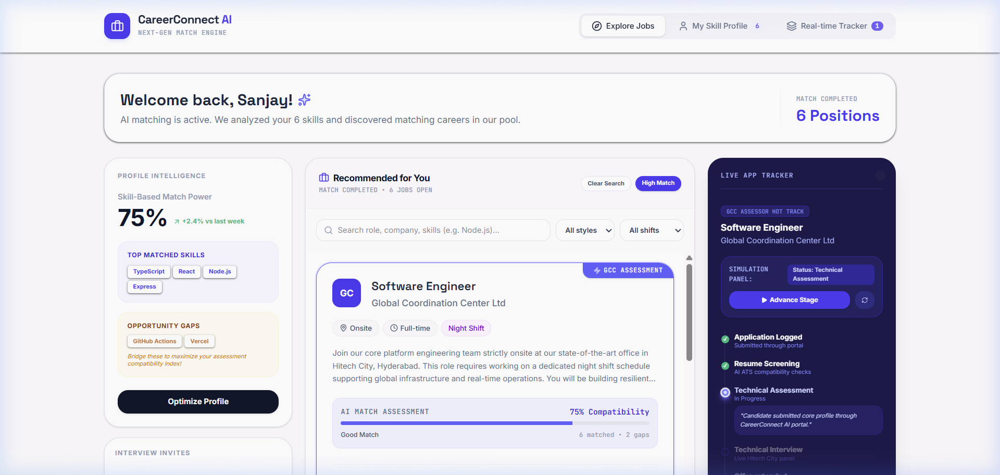

# CareerConnect AI - Advanced Job Board Platform

An advanced full-stack job portal featuring real-time application tracking, AI skill-based matching, and custom profile management.



## Core Features
- **AI Skill-Based Matcher**: Uses Gemini 3.5 Flash to perform deep semantic alignment of candidate skills against job definitions.
- **Real-time Telemetry Tracker**: Visualizes the full application process stage-by-stage with terminal log output.
- **Interactive Resume Builder & Parser**: Paste text to extract professional summary and skill tags using AI.

## Run Locally

### Prerequisites
- Node.js (v18 or higher)
- Google Gemini API Key

### Getting Started
1. Install project dependencies:
   ```bash
   npm install
   ```
2. Set up your environment variables by creating a `.env` file at the root of the project (see `.env.example`):
   ```env
   GEMINI_API_KEY="your_api_key_here"
   APP_URL="http://localhost:3000"
   ```
3. Run the development server:
   ```bash
   npm run dev
   ```
   Open [http://localhost:3000](http://localhost:3000) to view the application in the browser.

## Deployment & CI/CD
See the full [DOCUMENTATION.md](DOCUMENTATION.md) for detailed deployment configurations on Vercel and GitHub Actions.
